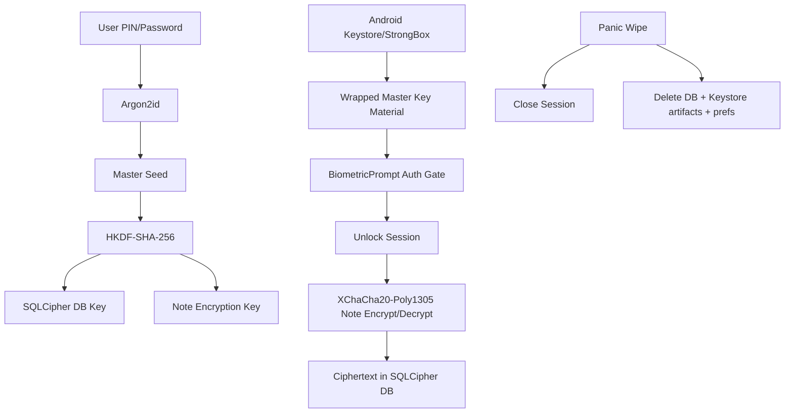

# NULVEX Crypto Flow Diagram

Notes:
- Biometrics are used for authentication to unlock wrapped key material.
- Biometrics are not a standalone cryptographic secret source.
- Hybrid KEM module (X25519 + ML-KEM-768) is available for future sync envelopes.
